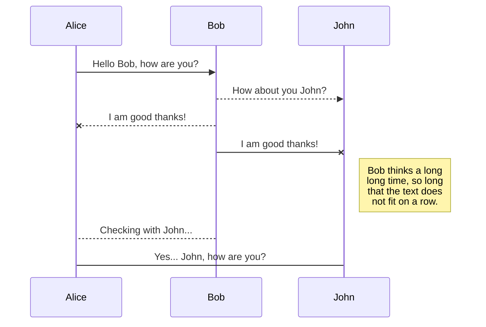

# Création d'un widget(extension) météo wordPress!

## I-Étape 1 :
Pour développer le plugin wordpress météo ,la plus simple méthode que j'ai trouvé c'est d'aller sur **la documentation officielle de wordpress** qui est en anglais et très complète.
Elle donne un exemple de création d'un plugin texte et son explication étape par étape.

**exemple d'un widget texte** : 


 Dans le dossier wordpress/wp-content/plugins/temperature  je crée un fichier temperature.php  et je colle le code de l'exemple pour suivre la structure donné de wordpress.
 Ce qui j'ai compris dans l'exemple :
 1-
 -Pour créé un widget on doit commencer par configurer une classe widget qui étend de la classe WP widget .
 et dans le constructeur de la classe on appelle le constructeur parent et on lui passe l’ID et le nom de base du widget et la description
 2-

-Ensuite on déclare la fonction widget (une fonction très importante) qui va nous permettre d’afficher quelque chose dans la barre latérale (afficher le contenu dans la barre latérale ), et on déclare les arguments qu’on utilise lors de la création de notre widget. Il y a quatre arguments qu’on doit définir, `before_title`, `after_title`, `before_widget`et `after_widget`. Ces arguments définiront le code qui enveloppe le titre du widgets et le widget lui-même.=>en résumé : la fonction widget reçoit deux paramètres (un premier tableau $args avec les arguments nécessaires a affichage du widget et $instance paramètres spécifiques
A ce widget la  qui va être afficher).
3-
- La fonction form qui va récupérer le titre et afficher le label et le champs de texte avec a l’intérieur le titre  récupérer.
4-
Dernière fonction update qui va permettre de modifier les valeur juste avant de les sauvegarder elle reçoit les nouvelles information $new_instance en prévenance du formulaire (l’utilisateur va taper dans le champs texte son titre et  va être envoyé a wordpress pour qu’il le stocke en base mais avant de le stocker en base on va pouvoir effectuer des versifications dans notre fonction update donc on reçoit avec le paramètre $new_instance les nouveaux  paramètres du  widget  et dans $old_instance les anciens.
## Étape 2 : 

Apres cette étape j’avait trouvé un problème => mon extension n’a pas été détecté dans l extension de wordpress  alors j’ai du faire une recherche dans  **la documentation wordpress**, j’ai trouvé le header a mettre au tout début pour que wordpress comprenne  que le fichier php ajouté est une extension (image 1) et la fonction a ajouté qui permet  l'enregistrement de ce widget(image 2) .

**image 1 :**


**image 2 :** 

 

**Résultat** : le  widget est détecté et affiché voir les image ci-dessous (**image 1 :** l'affichage du widget , **images 2 :** la fonction  nécessaire a l'affichage du formulaire du widget) .

**image 1 : **


**image 2 :**

 
 ## Étape 3 :
 
Jusqu’ici je considéré que l'étape 2 est fini et je passe a la récupération de la température  Avec l’Api OpenWeather , site correspondant ([https://openweathermap.org/api](https://openweathermap.org/api))) et je remplace tout ce qui concerne le titre  par le nom de la ville et a la place de l’affichage du texte je vais récupérer et afficher  la température qui correspond a la ville pour la quelle j'ai  renseigné le nom de  la ville:
**Résultat :**


# Files

StackEdit stores your files in your browser, which means all your files are automatically saved locally and are accessible **offline!**

## Create files and folders

The file explorer is accessible using the button in left corner of the navigation bar. You can create a new file by clicking the **New file** button in the file explorer. You can also create folders by clicking the **New folder** button.

## Switch to another file

All your files and folders are presented as a tree in the file explorer. You can switch from one to another by clicking a file in the tree.

-## Rename a file

You can rename the current file by clicking the file name in the navigation bar or by clicking the **Rename** button in the file explorer.

## Delete a file

You can delete the current file by clicking the **Remove** button in the file explorer. The file will be moved into the **Trash** folder and automatically deleted after 7 days of inactivity.

## Export a file

You can export the current file by clicking **Export to disk** in the menu. You can choose to export the file as plain Markdown, as HTML using a Handlebars template or as a PDF.


# Synchronization

Synchronization is one of the biggest features of StackEdit. It enables you to synchronize any file in your workspace with other files stored in your **Google Drive**, your **Dropbox** and your **GitHub** accounts. This allows you to keep writing on other devices, collaborate with people you share the file with, integrate easily into your workflow... The synchronization mechanism takes place every minute in the background, downloading, merging, and uploading file modifications.

There are two types of synchronization and they can complement each other:

- The workspace synchronization will sync all your files, folders and settings automatically. This will allow you to fetch your workspace on any other device.
	> To start syncing your workspace, just sign in with Google in the menu.

- The file synchronization will keep one file of the workspace synced with one or multiple files in **Google Drive**, **Dropbox** or **GitHub**.
	> Before starting to sync files, you must link an account in the **Synchronize** sub-menu.

## Open a file

You can open a file from **Google Drive**, **Dropbox** or **GitHub** by opening the **Synchronize** sub-menu and clicking **Open from**. Once opened in the workspace, any modification in the file will be automatically synced.

## Save a file

You can save any file of the workspace to **Google Drive**, **Dropbox** or **GitHub** by opening the **Synchronize** sub-menu and clicking **Save on**. Even if a file in the workspace is already synced, you can save it to another location. StackEdit can sync one file with multiple locations and accounts.

## Synchronize a file

Once your file is linked to a synchronized location, StackEdit will periodically synchronize it by downloading/uploading any modification. A merge will be performed if necessary and conflicts will be resolved.

If you just have modified your file and you want to force syncing, click the **Synchronize now** button in the navigation bar.

> **Note:** The **Synchronize now** button is disabled if you have no file to synchronize.

## Manage file synchronization

Since one file can be synced with multiple locations, you can list and manage synchronized locations by clicking **File synchronization** in the **Synchronize** sub-menu. This allows you to list and remove synchronized locations that are linked to your file.


# Publication

Publishing in StackEdit makes it simple for you to publish online your files. Once you're happy with a file, you can publish it to different hosting platforms like **Blogger**, **Dropbox**, **Gist**, **GitHub**, **Google Drive**, **WordPress** and **Zendesk**. With [Handlebars templates](http://handlebarsjs.com/), you have full control over what you export.

> Before starting to publish, you must link an account in the **Publish** sub-menu.

## Publish a File

You can publish your file by opening the **Publish** sub-menu and by clicking **Publish to**. For some locations, you can choose between the following formats:

- Markdown: publish the Markdown text on a website that can interpret it (**GitHub** for instance),
- HTML: publish the file converted to HTML via a Handlebars template (on a blog for example).

## Update a publication

After publishing, StackEdit keeps your file linked to that publication which makes it easy for you to re-publish it. Once you have modified your file and you want to update your publication, click on the **Publish now** button in the navigation bar.

> **Note:** The **Publish now** button is disabled if your file has not been published yet.

## Manage file publication

Since one file can be published to multiple locations, you can list and manage publish locations by clicking **File publication** in the **Publish** sub-menu. This allows you to list and remove publication locations that are linked to your file.


# Markdown extensions

StackEdit extends the standard Markdown syntax by adding extra **Markdown extensions**, providing you with some nice features.

> **ProTip:** You can disable any **Markdown extension** in the **File properties** dialog.


## SmartyPants

SmartyPants converts ASCII punctuation characters into "smart" typographic punctuation HTML entities. For example:

|                |ASCII                          |HTML                         |
|----------------|-------------------------------|-----------------------------|
|Single backticks|`'Isn't this fun?'`            |'Isn't this fun?'            |
|Quotes          |`"Isn't this fun?"`            |"Isn't this fun?"            |
|Dashes          |`-- is en-dash, --- is em-dash`|-- is en-dash, --- is em-dash|


## KaTeX

You can render LaTeX mathematical expressions using [KaTeX](https://khan.github.io/KaTeX/):

The *Gamma function* satisfying $\Gamma(n) = (n-1)!\quad\forall n\in\mathbb N$ is via the Euler integral

$$
\Gamma(z) = \int_0^\infty t^{z-1}e^{-t}dt\,.
$$

> You can find more information about **LaTeX** mathematical expressions [here](http://meta.math.stackexchange.com/questions/5020/mathjax-basic-tutorial-and-quick-reference).


## UML diagrams

You can render UML diagrams using [Mermaid](https://mermaidjs.github.io/). For example, this will produce a sequence diagram:



And this will produce a flow chart:

```mermaid
graph LR
A[Square Rect] -- Link text --> B((Circle))
A --> C(Round Rect)
B --> D{Rhombus}
C --> D
![alt text](http:/piscsum.pho
|  |  |
|--|--|
|  |  |

```